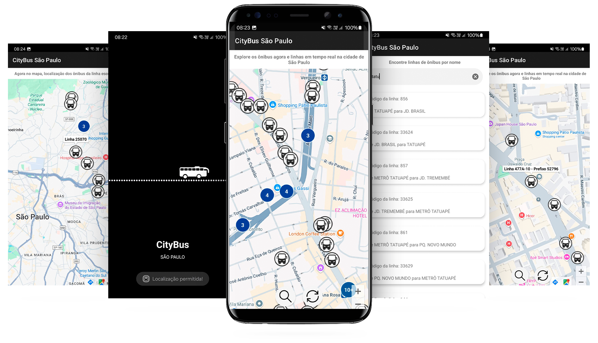

# CityBus São Paulo App

## Overview

Este aplicativo móvel é um guia de posições de ônibus da SPTrans, permitindo aos usuários visualizar em tempo real a localização dos ônibus em circulação na cidade de São Paulo. Com uma interface intuitiva, o aplicativo oferece uma experiência de navegação urbana moderna e eficiente.

O aplicativo utiliza a [API da SPTrans](https://www.sptrans.com.br/desenvolvedores/api-do-olho-vivo-guia-de-referencia/documentacao-api/) para fornecer dados atualizados e precisos.

Desenvolvido em apenas 4 dias, sem prévia experiência com mapas, este projeto demonstra a capacidade de aprendizado rápido e implementação eficiente.

## Funcionalidades Principais

- Visualização em tempo real da localização dos ônibus circulando na cidade
- Pesquisa por linhas de ônibus com exibição das posições atualizadas
- Mapa personalizado para melhor visualização da rede de ônibus
- Utilização da API da SPTrans para dados em tempo real
- Marcadores agrupados em clusters para otimização e performance

## Tecnologias Utilizadas

- **Kotlin**: Linguagem oficial do Android para desenvolvimento robusto e conciso
- **MVVM (Model-View-ViewModel)**: Arquitetura para separação clara de responsabilidades
- **Retrofit**: Biblioteca para chamadas HTTP eficientes
- **Injeção de Dependência com Koin**: Gerenciamento leve de dependências
- **Coroutines**: Trabalho assíncrono nativo do Kotlin
- **Custom View**: Componente personalizado para melhorar a experiência do usuário
- **Localização do Usuário**: Integração com o sistema de localização do Android
- **Google Maps API**: Para visualização interativa do mapa
- **Cluster Manager**: Otimização de marcadores próximos no mapa

## Melhorias Futuras

1. **Single Activity Architecture**: Refatoração para uma estrutura mais modular
2. **Melhoria na Obtenção de Localização**: Implementação de métodos mais precisos e eficientes
3. **Correção de Bugs na Busca**: Aprimoramento da funcionalidade de pesquisa
4. **Integração de Endpoints Adicionais**: Exploração de recursos adicionais da API da SPTrans
5. **Testes Unitários Completos**: Cobertura total com testes automatizados

## Instalação

Este projeto é um aplicativo Android desenvolvido em Kotlin. Para instalar e executar:

1. Certifique-se de ter instalado o Android Studio na sua máquina.
2. Clone este repositório ou baixe como ZIP.
3. Abra o projeto no Android Studio.
5. Construa e execute o aplicativo.

**[Download APK aqui!](https://drive.google.com/file/d/14bzGYQxtH45mMVS_IVRu98M4GwPTg1wq/view?usp=sharing)**

## Contribuições

Contribuições são bem-vindas! Se você tiver sugestões de melhorias ou quiser contribuir para o projeto, siga:

1. Fork este repositório.
2. Crie sua branch (`git checkout -b feature/sua-branch`).
3. Faça suas alterações.
4. Comite suas mudanças (`git commit -am 'Add some amazing feature'`).
5. Push para a branch (`git push origin feature/sua-branche`).
6. Abra uma Pull Request.

## Contato

Para perguntas, elogios ou críticas, entre em contato através do email: t_gaaby@hotmail.com
